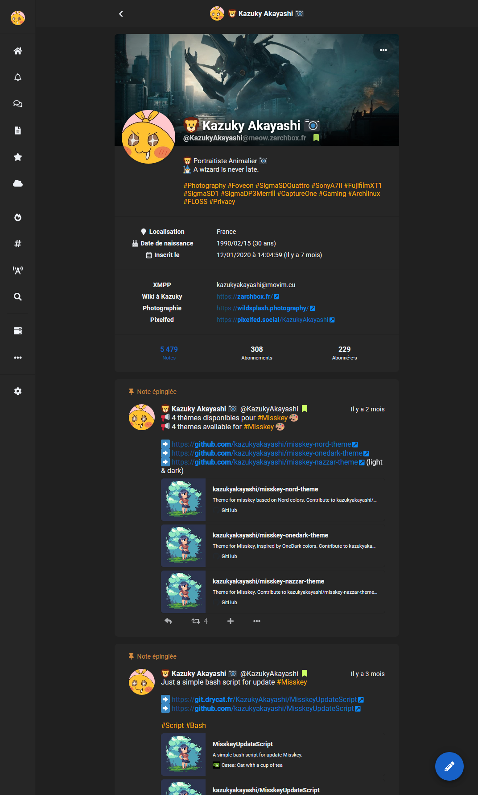

# Misskey Sombra Theme
Theme for misskey.

# Use
Copy this code on misskey theme editor.

```
{
	id: 'Sombra',

	name: 'Sombra',
	author: 'KazukyAkayashi',
 	desc: 'Hight contrast theme for Misskey',

	base: 'dark',

	props: {
	accent: '#1761c7',
	bg: '#202020',
	fg: '#eceff4',
	fgHighlighted: '@link',
	panel: '#262626',
	navBg: '#262626',
	navFg: '@fg',
	navHoverFg: '@accent',
	navActive: '@accent',
	navIndicator: '@accent',
	header: 'rgba(38, 38, 38, 0.75)',
	link: '#0a8afa',
	mention: '#eb404a',
	hashtag: '#ffad0f',
	renote: '#ad6eff',
	pageBg: '@bg',
	badge: '#ccff66',
	divider: 'rgba(32, 32, 32, 0.7)',
	driveFolderBg: '@panel',
	},
}
```

# Screenshot


